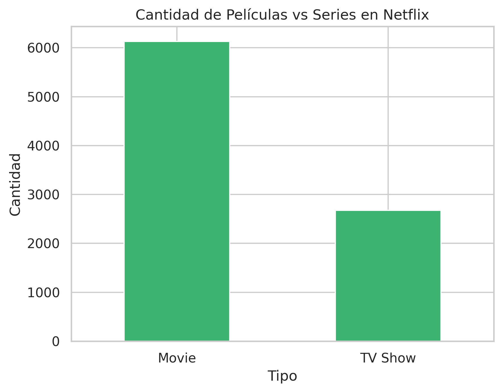

# 📺 Netflix EDA – Exploratory Data Analysis

This project analyzes the Netflix Shows dataset from Kaggle to explore patterns, trends, and content distribution across time and geography.

## 🔍 Objectives
- Understand the distribution of TV shows vs movies
- Analyze Netflix's global presence
- Detect content trends by year and country
- Explore title characteristics and genres

## 🧪 Technologies Used
- Python (pandas, matplotlib, seaborn)
- Jupyter Notebook
- CSV Dataset from Kaggle

## 📊 Key Insights
- [✓] Number of shows vs movies  
- [✓] Top 10 countries with most content  
- [✓] Most common genres and ratings  
- [✓] Yearly evolution of content

## 📂 Folder Structure
netflix-eda/
├── data/
├── notebook/
├── images/

## 🔗 Dataset
Available on [Kaggle – Netflix Titles](https://www.kaggle.com/datasets/shivamb/netflix-shows)

## 📈 Key Findings

After analyzing the Netflix dataset, several interesting insights emerged:

- **Movies dominate the platform**, accounting for a larger share of the content compared to TV Shows.
- **The United States leads** in content production, followed by India, the UK, and Canada. However, Netflix's catalog is diverse, including titles from all over the world.
- **The most active years for content addition** were 2019 and 2020, showing Netflix’s expansion in recent years.
- **Movie durations** are mostly between 80–100 minutes, with very few long-form titles.
- **Top genres** include Documentaries, Dramas, Comedies, and International content, reflecting the platform’s focus on varied storytelling.
- The **most frequent words in Netflix titles** are generic and include terms like "Love", "Life", and "Story", suggesting common themes across media.

These findings provide a basic but solid understanding of Netflix’s global catalog and can help inform further research, such as regional preferences, user recommendations, or content strategy.

## 🧑‍💻 Author
Eduardo Porlan
